<!--
  EslaM-X — GitHub Profile README v4
  Evidence-first + animated command center, restructured for clarity:
  IDENTITY → ENGINEERING EVIDENCE → ABOUT ME → FLAGSHIP PROJECTS →
  LIVE ENGINEERING STATUS → OPEN-SOURCE CONTRIBUTIONS → CASE STUDIES/CV/CONTACT
  → GITHUB ARSENAL → LANGUAGES & TOOLS.
  Every statement backed by a public repo or a verifiable link; telemetry
  assets generated from live GitHub data (scripts/generate-arsenal.js +
  .github/workflows/update-profile.yml). Zero data removed from v3.
  Logo: assets/x-crown-logo.jpg (in-repo) / live at https://eslamx.vercel.app/x-crown-logo.jpg
-->

<h3>EslaM HeshAM — MR-X</h3>

<b>Technical Architect</b> · Business Operations Manager · Web3 &amp; Cyber Security · Cairo, Egypt 🇪🇬 · Remote Worldwide

---

## ⚜️ Engineering Evidence

**Evidence over claims** — this profile is built the same way I build systems:
**every claim below points at a public repository, a PR, or a benchmark that
can be opened and checked.** No numbers here are estimated — if it is stated,
it is verifiable.

| What I state | Where you verify it |
| --- | --- |
| I engineer robotics + policy systems | [robot-sim-policy-lab](https://github.com/EslaM-X/robot-sim-policy-lab) — 18 tests, 3 physics backends, CI green |
| I build production AI agent platforms | [ai-agent-automation-platform](https://github.com/EslaM-X/ai-agent-automation-platform) — 17 evaluation cases, 6 dimensions, regression gate |
| I engineer financial/API reliability | [production-systems-lab](https://github.com/EslaM-X/production-systems-lab) — 37 Go tests, failure matrix, benchmarks |
| I write deep engineering analysis | [engineering-notes](https://github.com/EslaM-X/engineering-notes) — 5 problem-first dives, 5 ADRs |
| I contribute to Web3 protocols | [PiRC PR #2](https://github.com/PiNetwork/PiRC/pull/2), [stellar-core PR #5409](https://github.com/stellar/stellar-core/pull/5409) |
| I contribute to machine-payable robotics (external OSS) | [fabricfoundation/RoboPay](https://github.com/fabricfoundation/RoboPay) — Spot [PR #86](https://github.com/fabricfoundation/RoboPay/pull/86) · Go2 [PR #89](https://github.com/fabricfoundation/RoboPay/pull/89), both Tier-1 (see portfolio) |

The full evidence matrix lives in the **[portfolio repository](https://github.com/EslaM-X/portfolio)**.

> 🔧 **Single source of truth**: the numbers above are rendered from
> [`profile-data/evidence.json`](profile-data/evidence.json). When a number
> changes (17 → 21, 37 → 42, 5 → 6), edit that one file and the evidence
> panel regenerates — no hunting through files. The pipeline: implementation →
> tests → evaluation → failure analysis → architecture → decisions →
> reproducible evidence.

---

## ⚜️ About Me

- 🏛️ **Technical Architect @ Map of Pi** — high-scale MERN architecture, AI integration, security layers.
- 🤖 **Robotics & physical AI** — policy-driven navigation, sim-to-sim validation across MuJoCo + PyBullet, machine-payable agents.
- ⛓️ **Web3 core systems** — protocol standards (PiRC1), consensus research, smart-contract auditing (Foundry, invariant testing).
- 🛡️ **Cyber security & digital forensics** — zero-trust design, threat modeling, malware research, OSINT.
- 📈 **Business Operations Manager @ S.I.G / Steinheim** — built the ERP, invoicing and audit systems running in production today.

---

## 🚀 Flagship Projects

| Project | What it is | Status |
| --- | --- | --- |
| [**robot-sim-policy-lab**](https://github.com/EslaM-X/robot-sim-policy-lab) | Policy → planner → controller → 3 simulators; measured 0.26 m max sim-to-sim deviation | Public · CI green · v0.1.0 |
| [**ai-agent-automation-platform**](https://github.com/EslaM-X/ai-agent-automation-platform) | Human-gated, audited agent orchestration · 17 evaluation cases · 6 dimensions · regression gate | Public · CI green · v0.3.0 |
| [**production-systems-lab**](https://github.com/EslaM-X/production-systems-lab) | Idempotency, replay, circuit-breakers, HMAC auth, hash-chained audit (Go) · 37 tests | Public · CI green · v0.1.0 |
| [**engineering-notes**](https://github.com/EslaM-X/engineering-notes) | 5 deep dives + 5 ADRs: robotics → payments → CI → secure APIs | Public · v1.0.0 |

> 🔒 Enterprise work (Steinheim ERP & Invoicing, S.I.G platforms) lives in private repositories — available on request.
>
> 🔭 The rest of my public repositories — every repo I own and maintain — is browsable under [Repositories](https://github.com/EslaM-X?tab=repositories).

---

## 📡 Live Engineering Status

**Live, not claimed** — the panel below is fetched from the GitHub API every
day. It shows the **version, the engineering proof, and the real CI result** of
each flagship repository. Stars/forks/issues are live metadata (hover a row);
the CI badge reflects the real run, never a hard-coded claim.

> 🛡️ **Governed public engineering** — [20 public repositories](https://github.com/EslaM-X?tab=repositories) · protected default branches. The process — plan, prove, present, govern — is documented in the [portfolio](https://github.com/EslaM-X/portfolio/blob/main/engineering/methodology.md).
>
> 📡 **Daily refresh**: stars, forks, open issues, latest release, last push,
> and the CI conclusion are fetched from `api.github.com` and regenerated by
> the [`update-profile-assets`](.github/workflows/update-profile.yml) workflow.

---

## 🏆 Open-Source Contributions

| Protocol | Contribution | Verifiable at |
| --- | --- | --- |
| [**Pi Network — PiRC**](https://github.com/PiNetwork/PiRC/pull/2) | Proposed PiRC1 utility standards: escrow lock proofs, dynamic `p_floor`, engagement-weighted PiPower, Sybil-resistant reporting | [PR #2](https://github.com/PiNetwork/PiRC/pull/2) — received technical review and feedback from Pi Network founder Nicolas Kokkalis |
| [**Stellar — stellar-core**](https://github.com/stellar/stellar-core/pull/5409) | Contribution to the reference P2P implementation behind Stellar consensus | [PR #5409](https://github.com/stellar/stellar-core/pull/5409) |
| [**Fabric Foundation — RoboPay**](https://github.com/fabricfoundation/RoboPay) | External OSS contribution — machine-payable robotics: Spot [PR #86](https://github.com/fabricfoundation/RoboPay/pull/86) + Go2 [PR #89](https://github.com/fabricfoundation/RoboPay/pull/89) Tier-1 submissions, x402 gating, infra hardening PRs | [PR #86](https://github.com/fabricfoundation/RoboPay/pull/86) · [PR #89](https://github.com/fabricfoundation/RoboPay/pull/89) · authorship archives: [Go2](https://github.com/EslaM-X/robopay-go2-tier1) · [Spot](https://github.com/EslaM-X/robopay-spot-tier1) + evidence in [portfolio](https://github.com/EslaM-X/portfolio) |

---

## 📄 Case Studies · CV · Contact

| Case Study | What it covers |
| --- | --- |
| [AI Agent Automation](https://github.com/EslaM-X/portfolio/blob/main/case-studies/ai-agent-automation.md) | Human-gated agent orchestration, evaluation, regression gate |
| [Robotics — RoboPay](https://github.com/EslaM-X/portfolio/blob/main/case-studies/robopay.md) | Spot + Go2 Tier-1, sim-to-sim validation, x402 · authorship archives: [Go2](https://github.com/EslaM-X/robopay-go2-tier1) · [Spot](https://github.com/EslaM-X/robopay-spot-tier1) |
| [Production Systems](https://github.com/EslaM-X/portfolio/blob/main/case-studies/production-systems-lab.md) | Idempotency, replay, circuit-breakers, HMAC audit |
| [Pi Network / PiRC](https://github.com/EslaM-X/portfolio/blob/main/case-studies/pi-network.md) | Protocol standards research, consensus |
| [Systems Engineering](https://github.com/EslaM-X/portfolio/blob/main/case-studies/systems-engineering.md) | Methodology and evidence process |

**CV:** [portfolio/CV.md](https://github.com/EslaM-X/portfolio/blob/main/CV.md)

[-0A0A0A?style=for-the-badge&logo=x&logoColor=FFB627)](https://x.com/EslaM_HeshAM_X)

---

## ⚡ GitHub Arsenal

*ENGINEERING TELEMETRY · SYSTEMS · ACTIVITY · EVIDENCE*

> 📡 **Telemetry**: these panels regenerate from live GitHub data every day via the
> [`update-profile-assets`](.github/workflows/update-profile.yml) workflow.
> The motion is pure SMIL — no JavaScript, renders everywhere GitHub does.
> Every metric links to a public repository or PR — evidence, not estimates.

---

## ⚔️ Languages & Tools

---

**⚜️ [ESLAM-X · eslamx.vercel.app](https://eslamx.vercel.app) ⚜️**

`Systems & Protocol Engineer · Robotics · AI Agents · Payments · Evidence-First Engineering`

